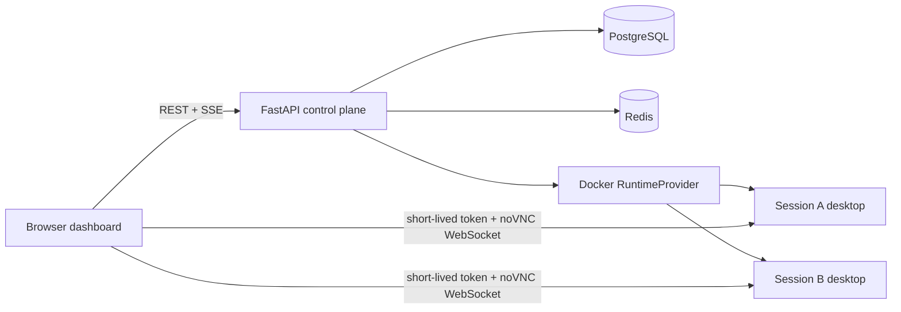

# Claude Computer Use Session Manager

[中文说明](README.md)

A multi-session control plane for computer-use agents. FastAPI manages sessions and runs, PostgreSQL stores durable history, Redis distributes live events, and each session receives an isolated Docker desktop exposed through noVNC.

The repository keeps the Anthropic computer-use demo under `computer_use_demo/` as the upstream baseline. The running application uses FastAPI and a same-origin HTML/CSS/JavaScript dashboard; Streamlit is not part of the Compose runtime.

## Requirement coverage

| Challenge requirement | Implementation |
| --- | --- |
| FastAPI session management | REST endpoints for session creation, lookup, listing, task submission, stop, and delete |
| Real-time progress | Standards-based SSE with Redis notifications, heartbeat, `Last-Event-ID`, database replay, and ID deduplication |
| VNC desktop access | One Linux desktop container per session, with Firefox, x11vnc, websockify, and noVNC |
| Persistent chat history | PostgreSQL models for sessions, runs, messages, and events, managed by Alembic migrations |
| Concurrent requests without races | PostgreSQL row locks, an active-run partial unique index, and request idempotency keys |
| Local and remote Docker setup | Development Compose stack plus a production override with tighter runtime constraints |
| Basic frontend | Same-origin HTML/CSS/JavaScript dashboard for sessions, tasks, messages, SSE events, and noVNC |
| Reviewable delivery | Six merged milestone pull requests, followed by a reviewer-facing cleanup pull request |

## Architecture



PostgreSQL is the source of truth. Redis is used only for low-latency delivery, so a temporary Redis publishing failure does not erase an event. Docker implements the runtime boundary: each logical session maps to one named desktop container.

## Key design decisions

### Session and run model

A session represents one isolated desktop. A run represents one user task executed inside that desktop. Session and run states are explicit, persisted, and validated before every transition.

`POST /api/v1/sessions/{id}/runs` returns `202 Accepted`. FastAPI continues the run in the background, which keeps the API responsive for this challenge-sized deployment. The `AgentRunner` interface allows a separate worker queue to replace the in-process task later without changing the HTTP contract.

### Real-time event delivery

The browser mainly receives progress from the server, so SSE keeps the client protocol simple. noVNC continues to use its own WebSocket connection.

The event path is:

1. Persist the event in PostgreSQL and assign its database ID.
2. Publish the event envelope through Redis.
3. Stream the live event to connected SSE clients.
4. On reconnect, accept `Last-Event-ID` and replay later rows from PostgreSQL.

The stream subscribes to Redis before loading missed history. Database IDs then remove duplicates between the replayed and live paths. This ordering prevents an event gap during reconnect.

### Concurrency and idempotency

One session owns one browser and may have only one active run. Run creation locks the session row with `SELECT FOR UPDATE`. A PostgreSQL partial unique index independently prevents two `PENDING` or `RUNNING` rows for the same session.

An `Idempotency-Key` is unique within a session. Retrying the same request returns the existing run, while a competing new task receives HTTP `409`. Locks are scoped to one session and a short transaction, so different sessions can still run concurrently.

### Isolated desktop runtime

Every session creates a Docker sandbox with a stable name derived from its UUID. The image contains Xvfb, Openbox, Firefox, x11vnc, websockify, and noVNC. CPU, memory, PID, shared-memory, capability, and privilege limits are applied when the container starts.

The API issues a short-lived noVNC token bound to that container. Tokens from one session cannot be used to open another session's desktop. A runtime reconciler restores bindings after an API restart and removes expired or orphaned managed containers.

### Anthropic tool bridge

`RunExecutor` loads the session's runtime ID from PostgreSQL and passes it to the selected runner. In Anthropic mode, `computer` and `bash` tools are backed by a `DockerSandboxExecutor` for that exact runtime. Model credentials remain in the API process and are not forwarded to the desktop container.

The deterministic fake runner uses the same event interface for local demos and automated tests. Switching `AGENT_PROVIDER` selects the real Anthropic runner without changing session or streaming code.

## Quick start on Windows 11

### Prerequisites

- Windows 11 with Docker Desktop using the WSL2 backend
- Docker Desktop showing `Engine running`
- Git
- Python 3.11 only for host-side quality checks
- At least 4 CPU cores, 8 GB RAM, and 5 GB free disk space recommended

### Clone and start

```powershell
git clone https://github.com/JaffarL/claude-computer-use-session-manager.git
Set-Location .\claude-computer-use-session-manager
git switch main

Set-ExecutionPolicy -Scope Process Bypass
.\scripts\dev.ps1
```

The script creates `.env` from `.env.example` when needed, builds the API and sandbox images, starts PostgreSQL and Redis, applies migrations, and waits for readiness.

Open:

- Dashboard: <http://127.0.0.1:8000/>
- OpenAPI: <http://127.0.0.1:8000/docs>
- Readiness: <http://127.0.0.1:8000/health/ready>

The default fake agent requires no API key and does not incur model charges.

### Manual demo flow

1. Select `新建隔离会话` (**New isolated session**) and wait for `READY`.
2. Submit a browser task.
3. Watch the conversation, SSE timeline, and noVNC desktop.
4. Refresh the page and confirm that messages and events return from PostgreSQL.
5. Select `停止` (**Stop**) and confirm that the desktop is no longer available.

For a repeatable API and runtime smoke test:

```powershell
.\scripts\smoke.ps1
```

The smoke script creates a real sandbox, runs the fake agent, checks VNC access, messages, and events, and removes the temporary session.

## Using the Anthropic runner

Keep the default fake runner for development and CI. To perform a real model run, set these values in the Git-ignored `.env` file:

```dotenv
AGENT_PROVIDER=anthropic
ANTHROPIC_API_KEY=your-key
ANTHROPIC_BASE_URL=
ANTHROPIC_MODEL=your-supported-model-id
```

`ANTHROPIC_BASE_URL` should remain empty for the official Anthropic endpoint. An Anthropic-compatible gateway may require its own Base URL, model ID, and `ANTHROPIC_AUTH_TOKEN` instead of `ANTHROPIC_API_KEY`.

Real mode consumes paid API tokens. Never commit `.env`, credentials, or screenshots that contain secrets.

## API summary

| Method | Path | Purpose |
| --- | --- | --- |
| `POST` | `/api/v1/sessions` | Create a session and desktop sandbox |
| `GET` | `/api/v1/sessions` | List sessions with pagination |
| `GET` | `/api/v1/sessions/{id}` | Read one session |
| `POST` | `/api/v1/sessions/{id}/runs` | Submit a task; accepts `Idempotency-Key` |
| `GET` | `/api/v1/sessions/{id}/runs` | Read run history |
| `GET` | `/api/v1/sessions/{id}/messages` | Read persisted chat history |
| `GET` | `/api/v1/sessions/{id}/events` | Stream SSE events and reconnect with `Last-Event-ID` |
| `GET` | `/api/v1/sessions/{id}/events/history` | Read persisted event history |
| `POST` | `/api/v1/sessions/{id}/vnc-access` | Issue a short-lived noVNC URL |
| `POST` | `/api/v1/sessions/{id}/stop` | Stop a session idempotently |
| `DELETE` | `/api/v1/sessions/{id}` | Delete the runtime and soft-delete the session |

The complete request and response schemas are available through OpenAPI at `/docs`.

## Configuration

| Variable | Default | Purpose |
| --- | --- | --- |
| `POSTGRES_USER/PASSWORD/DB` | Development values | Local PostgreSQL settings |
| `RUNTIME_NAMESPACE` | `computer-use-session-manager` | Separates managed containers on a shared Docker Engine |
| `SANDBOX_PUBLIC_HOST` | `127.0.0.1` | Hostname returned in noVNC URLs |
| `SANDBOX_MEMORY_LIMIT` | `768m` | Memory limit per desktop |
| `SANDBOX_NANO_CPUS` | `1000000000` | CPU limit per desktop, equal to one core |
| `SANDBOX_PIDS_LIMIT` | `256` | Process limit per desktop |
| `VNC_ACCESS_TTL_SECONDS` | `120` | Lifetime of a noVNC access token |
| `AGENT_PROVIDER` | `fake` | Selects `fake` or `anthropic` execution |
| `ANTHROPIC_API_KEY` | Empty | Official API or compatible gateway credential |
| `ANTHROPIC_AUTH_TOKEN` | Empty | Compatible gateway credential alias |
| `ANTHROPIC_BASE_URL` | Empty | Compatible gateway endpoint |
| `ANTHROPIC_MODEL` | Empty | Model ID supported by the selected endpoint |
| `ANTHROPIC_MAX_TOKENS` | `4096` | Maximum response tokens per model turn |
| `ANTHROPIC_MAX_ITERATIONS` | `30` | Maximum model/tool iterations per task |

## Quality checks

Create the host-side environment once:

```powershell
py -3.11 -m venv .venv
.\.venv\Scripts\python.exe -m pip install -r backend\requirements-dev.txt
```

Run the same checks used before submission:

```powershell
.\scripts\test.ps1
.\scripts\security-check.ps1
```

Current verified baseline: 28 pytest tests, Ruff formatting and linting, dependency consistency, JavaScript syntax, development and production Compose validation, and a tracked-file/history secret scan.

Tests cover:

- session CRUD, validation, stop, and soft delete;
- run conflicts and idempotent retries;
- SSE live delivery, heartbeat, replay, and deduplication;
- event and message persistence, including failure recovery;
- runtime creation, resource limits, namespace isolation, and reconciliation;
- VNC token isolation;
- Anthropic tool routing into the bound sandbox;
- frontend and health endpoints.

GitHub Actions runs the same checks for pull requests and pushes to `main`.

## Docker deployment

Development stack:

```powershell
docker compose up -d --build
```

Production-oriented override:

```powershell
docker compose -f compose.yaml -f compose.production.yaml config
docker compose -f compose.yaml -f compose.production.yaml up -d --build
```

The override adds loopback-only published ports, a read-only API filesystem, temporary writable paths, dropped capabilities, log rotation, automatic restart, and a longer graceful-stop period.

## Project layout

```text
backend/app/             FastAPI API, services, persistence, events, and runtime adapters
backend/migrations/      Alembic migrations
backend/tests/           Backend, streaming, runtime, agent, and frontend tests
computer_use_demo/       Retained Anthropic computer-use demo baseline
docker/                  API and desktop sandbox images
sandbox/                 Desktop entrypoint and health check
scripts/                 PowerShell start, test, smoke, security, and cleanup commands
compose.yaml             Local development stack
compose.production.yaml  Production-oriented override
```

## Review history

The implementation was delivered through six milestone pull requests:

1. Architecture and containerized foundation
2. Session API and PostgreSQL persistence
3. Agent events and SSE streaming
4. Isolated Docker runtime and noVNC
5. Demonstration frontend
6. Release candidate, operations, and Anthropic bridge

A seventh pull request cleaned reviewer-facing documentation without changing application behavior.

## Upstream and license

The retained `computer_use_demo/` baseline comes from Anthropic's [`anthropic-quickstarts/computer-use-demo`](https://github.com/anthropics/anthropic-quickstarts/tree/main/computer-use-demo). The FastAPI control plane, persistence, streaming, isolation, and frontend in this repository build on that baseline.

The original MIT license is preserved in [LICENSE](LICENSE).
