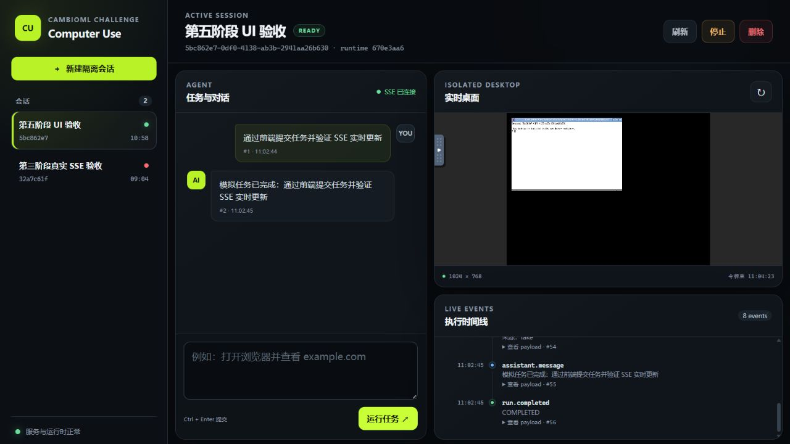
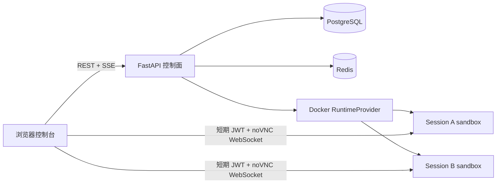

# Claude Computer Use Session Manager

一个面向 Computer Use Agent 的多会话控制面：FastAPI 管理会话和任务，PostgreSQL 保存历史，Redis 推送实时事件，每个会话使用独立 Docker 桌面，并通过短期 JWT 访问 noVNC。

当前发布候选版本提供原生 HTML/CSS/JS 控制台，可在一个页面内完成“创建会话 → 提交任务 → 查看 SSE 进度 → 查看隔离桌面 → 刷新恢复历史 → 停止会话”。



## 核心能力

- 会话、任务、消息和事件的 REST API；
- PostgreSQL 持久化和 Alembic 迁移；
- Redis 实时发布、标准 SSE、心跳和 `Last-Event-ID` 断线补发；
- 同会话并发保护、幂等键和跨会话并行执行；
- 一会话一 Docker sandbox：Xvfb、Openbox、Firefox、x11vnc、websockify/noVNC；
- 每容器独立短期 VNC JWT，CPU、内存、PID、共享内存和权限限制；
- API 重启后的 runtime 恢复，以及过期、孤儿和重复容器回收；
- 与 API 同源的零构建响应式前端；
- Windows 11 + PowerShell 开发、测试、冒烟和清理脚本。

## 架构



详细设计见 [架构说明](docs/architecture.md)，并发实测见 [并发证据](docs/concurrency-evidence.md)。

## 快速启动（Windows 11 + PowerShell）

### 前置条件

- Windows 11；
- Docker Desktop，使用 WSL2 后端且显示 `Engine running`；
- Git；
- Python 3.11（仅本地测试脚本需要；Docker 启动不需要主机 Python）；
- 建议至少 4 CPU、8 GB 内存和 5 GB 可用磁盘。

### 1. 获取代码

```powershell
git clone https://github.com/JaffarL/claude-computer-use-session-manager.git
Set-Location .\claude-computer-use-session-manager
git switch docs/release-candidate
```

仓库为私有时，先在浏览器登录有权限的 GitHub 账号，或完成 `gh auth login`。

### 2. 启动

```powershell
Set-ExecutionPolicy -Scope Process Bypass
.\scripts\dev.ps1
```

脚本会在缺少 `.env` 时从 `.env.example` 创建本地配置，构建镜像，启动 PostgreSQL、Redis 和 API，并等待 readiness 通过。

打开：

- 控制台：<http://127.0.0.1:8000/>
- OpenAPI：<http://127.0.0.1:8000/docs>
- Readiness：<http://127.0.0.1:8000/health/ready>

默认使用确定性 Fake Agent，不需要 API Key，也不会产生模型费用。

### 3. 页面演示

1. 点击“新建隔离会话”；
2. 输入任务并点击“运行任务”；
3. 同时观察聊天消息、SSE 时间线和 noVNC 桌面；
4. 刷新页面，确认消息和事件仍存在；
5. 点击“停止”，确认桌面关闭且容器被回收。

### 4. PowerShell 冒烟

```powershell
.\scripts\smoke.ps1
```

脚本会创建真实 sandbox、提交 Fake Agent 任务、核对 VNC 签发、消息和事件，最后自动删除测试会话；输出不会展示 JWT 或 API Key。

## 本地质量检查

首次准备 Python 环境：

```powershell
py -3.11 -m venv .venv
.\.venv\Scripts\python.exe -m pip install -r backend\requirements-dev.txt
```

运行完整检查：

```powershell
.\scripts\test.ps1
.\scripts\security-check.ps1
```

当前基线：23 个 pytest 测试，同时检查 Ruff、依赖一致性、JavaScript 语法、开发/生产 Compose 和常见密钥泄露。

## 停止与清理

只停止服务并保留 PostgreSQL/Redis 数据：

```powershell
.\scripts\cleanup.ps1 -Confirm:$false
```

连同项目数据卷一起删除：

```powershell
.\scripts\cleanup.ps1 -RemoveVolumes -Confirm:$false
```

`-RemoveVolumes` 会永久删除本地会话、消息和事件数据。增加 `-RemoveImages` 还会删除两个项目本地镜像。

## 配置

本地配置只写入 Git 忽略的 `.env`。不要把真实密钥写入源码、截图、日志或提交历史。

| 变量 | 默认值 | 作用 |
| --- | --- | --- |
| `POSTGRES_USER/PASSWORD/DB` | 开发值 | 本地 PostgreSQL |
| `RUNTIME_NAMESPACE` | `computer-use-session-manager` | 隔离同一 Docker Engine 上的不同控制面 |
| `SANDBOX_PUBLIC_HOST` | `127.0.0.1` | noVNC 返回地址的主机名 |
| `SANDBOX_MEMORY_LIMIT` | `768m` | 单 sandbox 内存上限 |
| `SANDBOX_NANO_CPUS` | `1000000000` | 单 sandbox CPU 上限（1 核） |
| `SANDBOX_PIDS_LIMIT` | `256` | 单 sandbox 进程数上限 |
| `VNC_ACCESS_TTL_SECONDS` | `120` | noVNC JWT 有效秒数 |
| `ANTHROPIC_API_KEY` | 空 | 预留的 Anthropic/兼容服务凭据 |
| `ANTHROPIC_BASE_URL` | 空 | 兼容服务入口；官方 Anthropic 留空 |
| `ANTHROPIC_MODEL` | 空 | 目标服务实际支持的模型 ID |

当前发布候选后端固定使用 Fake Agent 验证并发、持久化和实时协议。仓库保留了固定版本的 Anthropic Computer Use 上游代码与 UI 无关 callback adapter，但真实模型执行器尚未接入每会话远程桌面通道，因此填写后三个变量不会自动产生真实模型调用；详见“已知边界”。

## API

| 方法 | 路径 | 说明 |
| --- | --- | --- |
| `POST` | `/api/v1/sessions` | 创建会话和独立 sandbox |
| `GET` | `/api/v1/sessions` | 分页列出会话 |
| `GET` | `/api/v1/sessions/{id}` | 查询会话状态 |
| `POST` | `/api/v1/sessions/{id}/runs` | 提交任务，支持 `Idempotency-Key` |
| `GET` | `/api/v1/sessions/{id}/runs` | 查询运行历史 |
| `GET` | `/api/v1/sessions/{id}/messages` | 查询聊天历史 |
| `GET` | `/api/v1/sessions/{id}/events` | SSE 实时流和断线补发 |
| `GET` | `/api/v1/sessions/{id}/events/history` | 查询持久化事件 |
| `POST` | `/api/v1/sessions/{id}/vnc-access` | 签发短期 noVNC 地址 |
| `POST` | `/api/v1/sessions/{id}/stop` | 幂等停止会话 |
| `DELETE` | `/api/v1/sessions/{id}` | 销毁 runtime 并软删除会话 |

可复制的请求见 [PowerShell API 示例](docs/api-examples.md)。

## 生产 Compose 模板

```powershell
docker compose -f compose.yaml -f compose.production.yaml config
docker compose -f compose.yaml -f compose.production.yaml up -d --build
```

生产 override 增加本机回环端口、只读 API 文件系统、临时目录、capability 限制、日志轮转、自动重启和优雅停止时间。它是远程部署的基础模板，不代表已经具备不可信多租户生产安全性。远程入口、TLS/WSS 和密钥托管要求见 [部署说明](docs/deployment.md) 与 [安全说明](docs/security.md)。

## 目录

```text
backend/                 FastAPI、数据库、事件、runtime 和测试
docker/                  API 与 sandbox 镜像
sandbox/                 桌面进程监管和 healthcheck
scripts/                 PowerShell 开发、测试、冒烟、安全和清理脚本
docs/                    架构、安全、部署、API、故障排查和演示文档
docs/acceptance/         每个阶段的命令输出、截图和结论
compose.yaml             本地开发栈
compose.production.yaml  生产约束 override
```

## 关键设计选择

- PostgreSQL 是最终事实来源；Redis 只做低延迟通知，断线后按数据库 ID 补发；
- Session/Run 状态通过事务、行锁和唯一约束收敛；同会话双提交明确返回 202/409；
- runtime 使用 session UUID 稳定命名，并结合 Docker 名称唯一性避免重复创建；
- noVNC JWT 绑定单个容器的 HMAC 密钥和 VNC 目标，A 会话令牌不能访问 B；
- API lifespan 在停止时结束 reconciler，并关闭 Docker、Redis 和数据库连接。

## 验收证据

- [第二阶段：会话与历史 API](docs/acceptance/phase-2-session-api/README.md)
- [第三阶段：Agent 事件与 SSE](docs/acceptance/phase-3-agent-sse/README.md)
- [第四阶段：隔离 runtime 与 noVNC](docs/acceptance/phase-4-isolated-runtime/README.md)
- [第五阶段：演示前端](docs/acceptance/phase-5-demo-frontend/README.md)

## 已知边界

- 当前任务执行使用确定性 Fake Agent；真实 Anthropic callback 转换已测试，但完整的真实模型 → 每会话远程桌面工具桥接仍需实现；
- API 没有用户登录、session 所有权、审计和速率限制；
- 本地 API 挂载 Docker socket，控制面应被视为可信高权限组件；
- loopback 随机 noVNC 端口只适合本机演示，远程部署必须使用同源 HTTPS/WSS 代理；
- Docker 容器不是强安全虚拟机，不应在桌面中使用个人账号或生产凭据。

故障处理见 [故障排查](docs/troubleshooting.md)，五分钟录屏流程见 [演示脚本](docs/demo-script.md)。

## 上游与许可

Computer Use 基线来自 Anthropic `claude-quickstarts/computer-use-demo` 固定提交，详情见 [上游溯源](docs/upstream.md)。原始 MIT License 保留在仓库根目录。
