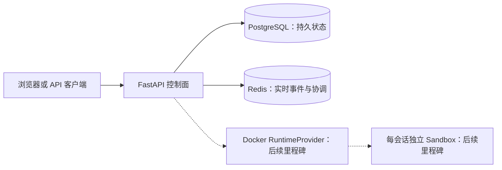

# 架构基础

## 目标

本项目把 Anthropic 官方单会话 Computer Use 演示改造成一个可以管理多个隔离会话的后端。当前里程碑只建立控制面基础；会话 API、实时事件、桌面运行时和 noVNC 代理将在后续里程碑中按 PR 逐步加入。

## 控制面边界



- FastAPI 负责请求校验、状态转换和对外协议，不保存进程内业务状态；
- PostgreSQL 是会话、运行、消息和事件的最终事实来源；
- Redis 只承担实时通知和短期协调，不能代替数据库一致性约束；
- 桌面容器由 `RuntimeProvider` 抽象管理，首个实现使用 Docker；
- 每个逻辑会话最终绑定一个独立桌面容器，避免浏览器、DISPLAY 和文件系统串线。

## 当前目录

```text
backend/
├─ app/
│  ├─ api/          # HTTP 路由
│  ├─ core/         # 配置和日志
│  ├─ db/           # 数据库模型和连接
│  ├─ schemas/      # API 数据模型
│  └─ services/     # 业务服务
├─ migrations/      # Alembic 迁移
└─ tests/           # 后端测试
```

## 健康检查语义

- `GET /health/live`：只证明 API 进程能够响应；
- `GET /health/ready`：实际检查 PostgreSQL 和 Redis，任一不可用就返回 HTTP 503；
- Docker Engine 与 runtime reconciler 的检查将在 RuntimeProvider 落地时加入 readiness。

## 已确定的设计决策

1. 使用 Python 3.11，避免主机 Python 版本差异影响结果；
2. 数据访问使用 SQLAlchemy 2 异步接口和 asyncpg；
3. 数据库结构必须通过 Alembic 迁移，不在应用启动时调用 `create_all`；
4. 配置只从环境变量和本地 `.env` 读取，真实 Key 不进入代码和 Git；
5. API 镜像启动时先执行 migration，再启动 Uvicorn；
6. CI 使用 fake dependency，不调用真实 Claude API，也不产生费用。
