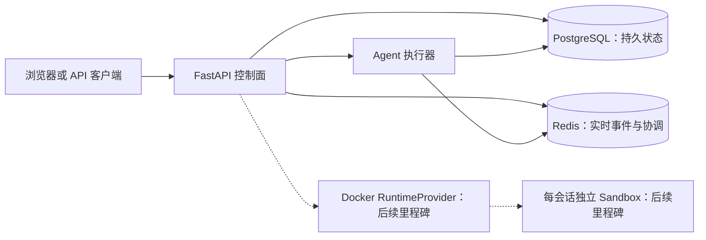
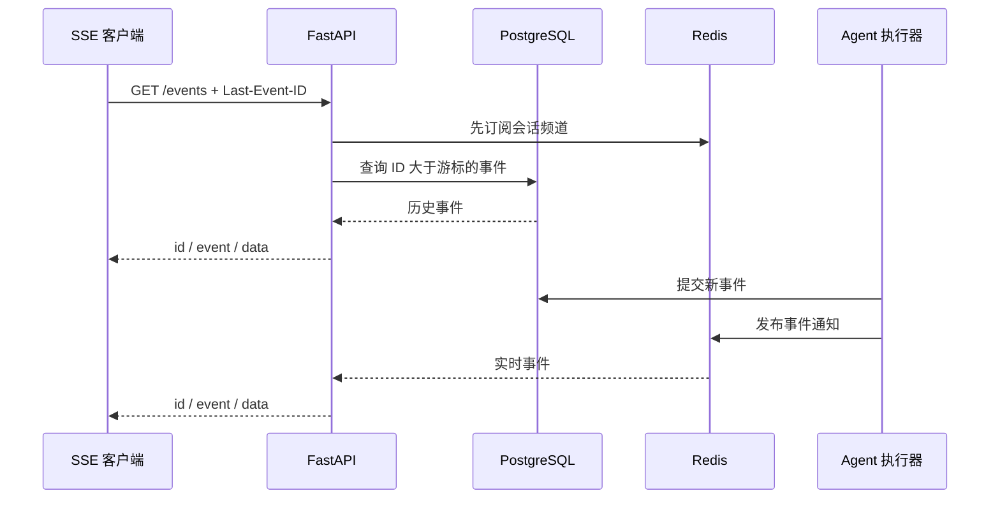

# 架构基础

## 目标

本项目把 Anthropic 官方单会话 Computer Use 演示改造成一个可以管理多个隔离会话的后端。当前已经具备会话 API、持久化历史和实时事件流；桌面运行时与 noVNC 代理将在后续里程碑加入。

## 控制面边界



- FastAPI 负责请求校验、状态转换和对外协议，不保存进程内业务状态；
- PostgreSQL 是会话、运行、消息和事件的最终事实来源；
- Redis 只承担实时通知和短期协调，不能代替数据库一致性约束；
- 桌面容器由 `RuntimeProvider` 抽象管理，首个实现使用 Docker；
- 每个逻辑会话最终绑定一个独立桌面容器，避免浏览器、DISPLAY 和文件系统串线。

## 当前目录

```text
backend/
├─ app/
│  ├─ agents/       # Agent 接口、fake runner、Anthropic 回调适配
│  ├─ api/          # REST 与 SSE 路由
│  ├─ core/         # 配置和日志
│  ├─ db/           # 数据库模型和连接
│  ├─ events/       # Redis 发布订阅抽象
│  ├─ repositories/ # 持久化查询
│  ├─ schemas/      # API 数据模型
│  └─ services/     # 业务服务
├─ migrations/      # Alembic 迁移
└─ tests/           # 后端测试
```

## 健康检查语义

- `GET /health/live`：只证明 API 进程能够响应；
- `GET /health/ready`：实际检查 PostgreSQL 和 Redis，任一不可用就返回 HTTP 503；
- Docker Engine 与 runtime reconciler 的检查将在 RuntimeProvider 落地时加入 readiness。

## 已确定的设计决策

1. 使用 Python 3.11，避免主机 Python 版本差异影响结果；
2. 数据访问使用 SQLAlchemy 2 异步接口和 asyncpg；
3. 数据库结构必须通过 Alembic 迁移，不在应用启动时调用 `create_all`；
4. 配置只从环境变量和本地 `.env` 读取，真实 Key 不进入代码和 Git；
5. API 镜像启动时先执行 migration，再启动 Uvicorn；
6. CI 使用 fake dependency，不调用真实 Claude API，也不产生费用。

## 实时事件协议

任务执行时，每个事件先提交到 PostgreSQL，再尽力发布到 Redis。Redis 暂时不可用不会丢失事件，客户端重连后仍可从数据库补发。



- `GET /api/v1/sessions/{session_id}/events` 返回 `text/event-stream`；
- `Last-Event-ID` 或 `after_id` 指定最后已处理的事件，服务端只发送更大的 ID；
- 每条业务消息均包含标准 SSE `id`、`event`、`data` 字段；
- 空闲连接定期发送无 ID 的 `heartbeat`，不会推进客户端游标；
- 单客户端队列有固定上限，消费者过慢时收到 `stream.reset` 并断开，随后可按最后 ID 补发；
- PostgreSQL 是事实来源，Redis 只负责跨进程低延迟扇出；
- `GET /api/v1/sessions/{session_id}/events/history` 提供等价的非流式历史查询。

当前确定性 fake agent 会生成 `run.started`、文本增量、工具开始、工具结果、截图、最终消息和 `run.completed`。上游 Anthropic 的同步 callback 由有界适配队列转换为同一套 UI 无关事件，避免 Agent 代码依赖 Streamlit。
