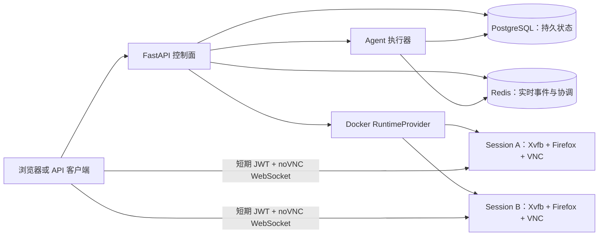
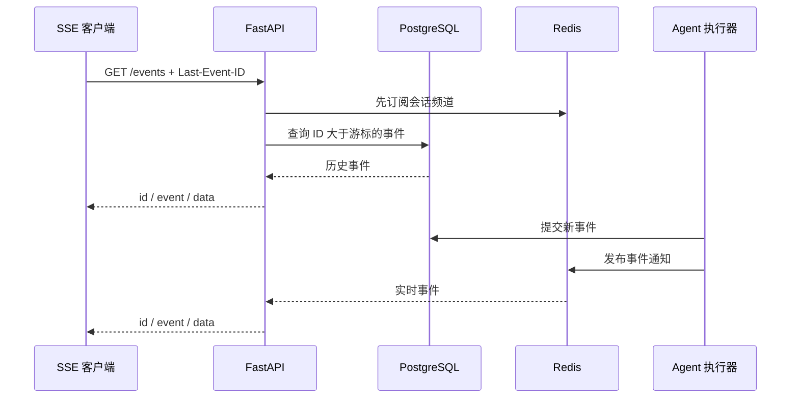

# 架构基础

## 目标

本项目把 Anthropic 官方单会话 Computer Use 演示改造成一个可以管理多个隔离会话的系统。当前已经具备会话 API、持久化历史、实时事件流、每会话独立的 Docker 桌面运行时、短期 noVNC 访问令牌，以及与 API 同源的演示控制台。

## 控制面边界



- FastAPI 负责请求校验、状态转换和对外协议，不保存进程内业务状态；
- PostgreSQL 是会话、运行、消息和事件的最终事实来源；
- Redis 只承担实时通知和短期协调，不能代替数据库一致性约束；
- 桌面容器由 `RuntimeProvider` 抽象管理，首个实现使用 Docker；
- 每个逻辑会话最终绑定一个独立桌面容器，避免浏览器、DISPLAY 和文件系统串线。

## 当前目录

```text
backend/
├─ app/
│  ├─ agents/       # Agent 接口、fake runner、Anthropic 回调适配
│  ├─ api/          # REST 与 SSE 路由
│  ├─ core/         # 配置和日志
│  ├─ db/           # 数据库模型和连接
│  ├─ events/       # Redis 发布订阅抽象
│  ├─ repositories/ # 持久化查询
│  ├─ runtime/      # Fake/Docker 运行时提供者
│  ├─ schemas/      # API 数据模型
│  ├─ static/       # 原生 HTML/CSS/JS 会话控制台
│  └─ services/     # 业务服务
├─ migrations/      # Alembic 迁移
└─ tests/           # 后端测试
docker/
└─ sandbox.Dockerfile
sandbox/
├─ entrypoint.sh    # X11、桌面、VNC、noVNC 进程监管
└─ healthcheck.py
```

## 健康检查语义

- `GET /health/live`：只证明 API 进程能够响应；
- `GET /health/ready`：实际检查 PostgreSQL、Redis；Docker 模式下还会检查 Docker Engine，任一不可用就返回 HTTP 503。

## 已确定的设计决策

1. 使用 Python 3.11，避免主机 Python 版本差异影响结果；
2. 数据访问使用 SQLAlchemy 2 异步接口和 asyncpg；
3. 数据库结构必须通过 Alembic 迁移，不在应用启动时调用 `create_all`；
4. 配置只从环境变量和本地 `.env` 读取，真实 Key 不进入代码和 Git；
5. API 镜像启动时先执行 migration，再启动 Uvicorn；
6. CI 使用 fake dependency，不调用真实 Claude API，也不产生费用。

## Docker 桌面运行时

`DockerRuntimeProvider` 以 session UUID 作为稳定容器名和标签的一部分。创建流程同时使用进程内 session 锁与 Docker 唯一容器名：同一 API 进程内的并发调用被串行化；多个控制面实例竞争时，由 Docker 的名称唯一性兜底，再复用已经创建的容器。

每个 sandbox 使用独立的 Xvfb display、浏览器 profile、文件系统、x11vnc 和 noVNC 进程。控制面只把 `6080/tcp` 映射到主机 `127.0.0.1` 的随机端口，不公开原始 `5900/tcp`。容器默认限制为 1 核 CPU、768 MiB 内存、256 个进程和 256 MiB 共享内存，并启用 `cap_drop=ALL` 与 `no-new-privileges`。

容器标签保存 runtime namespace、session ID、过期时间和组件类型。同一 Docker Engine 上的不同控制面使用不同 `RUNTIME_NAMESPACE`，reconciler 只查看自己的容器，避免交叉清理。控制面启动及之后每 30 秒执行对账：恢复数据库与容器的绑定、清理过期/孤儿/重复容器，并把异常退出的活跃会话标记为失败。API 停在 `STOPPING` 中间时，重启对账会在确认容器已退出后收敛为 `STOPPED`。

## noVNC 授权

`POST /api/v1/sessions/{session_id}/vnc-access` 只允许 `READY` 或 `RUNNING` 会话调用。每个 sandbox 创建时生成独立的 256 位 HMAC 密钥，控制面签发默认 120 秒有效的 JWT；websockify 在建立 WebSocket 前验证签名、到期时间和目标 VNC 地址。因此 A 的 token 不能访问 B 的桌面。

当前开发模式返回绑定主机 loopback 随机端口的 URL，适合本机演示。生产远程部署不能直接照搬 Docker socket 和随机端口方案，应通过只暴露 443 的反向代理/runtime-manager 转发 noVNC WebSocket；具体边界见 [安全说明](./security.md)。

## 实时事件协议

任务执行时，每个事件先提交到 PostgreSQL，再尽力发布到 Redis。Redis 暂时不可用不会丢失事件，客户端重连后仍可从数据库补发。



- `GET /api/v1/sessions/{session_id}/events` 返回 `text/event-stream`；
- `Last-Event-ID` 或 `after_id` 指定最后已处理的事件，服务端只发送更大的 ID；
- 每条业务消息均包含标准 SSE `id`、`event`、`data` 字段；
- 空闲连接定期发送无 ID 的 `heartbeat`，不会推进客户端游标；
- 单客户端队列有固定上限，消费者过慢时收到 `stream.reset` 并断开，随后可按最后 ID 补发；
- PostgreSQL 是事实来源，Redis 只负责跨进程低延迟扇出；
- `GET /api/v1/sessions/{session_id}/events/history` 提供等价的非流式历史查询。

当前确定性 fake agent 会生成 `run.started`、文本增量、工具开始、工具结果、截图、最终消息和 `run.completed`。上游 Anthropic 的同步 callback 由有界适配队列转换为同一套 UI 无关事件，避免 Agent 代码依赖 Streamlit。

## 同源演示前端

FastAPI 在 `/` 提供零构建的原生 HTML/CSS/JS 控制台，静态资源位于 `/static`。控制台只消费公开 REST、SSE 和 noVNC 接口，不读取数据库或 Docker socket，因此前端不会绕过控制面状态机。

页面切换会话时先关闭旧 EventSource，再并行读取 session、messages 和持久化 event history，随后以最后事件 ID 建立实时 SSE。事件按数据库 ID 去重；浏览器刷新后可完全从后端恢复。noVNC URL 由控制面按需签发，JWT 位于 noVNC 的 WebSocket `path` 参数中，不写入应用日志或持久化模型。
